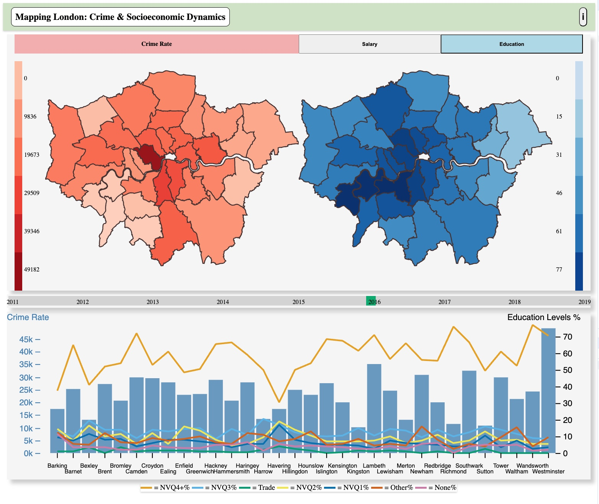

# King's 7CCSMSDV Introduction to Data Visualisation Coursework

## This code implements Q2 – Analyse the relationship between socioeconomic factors and trends in crimes in London.

The datasets used are also uploaded here, if there is a need to re-compile the parsed data file, this can be done in the parse_datasets.py. However, this should not be necessary.

To display the visulisation simpoly host the index.html file, ensuring that the files index.css and index.js are also included correctly in the path. Live Server should do this all automatically.

Below is an example image of what the site should look like:

